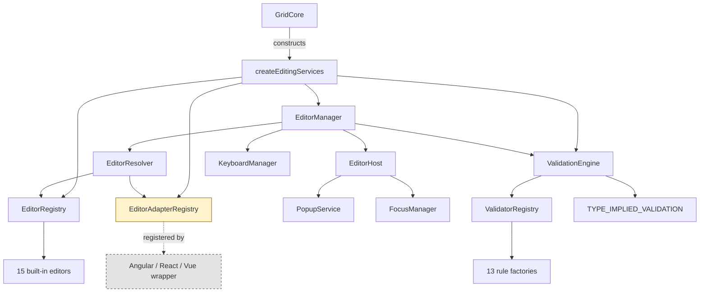
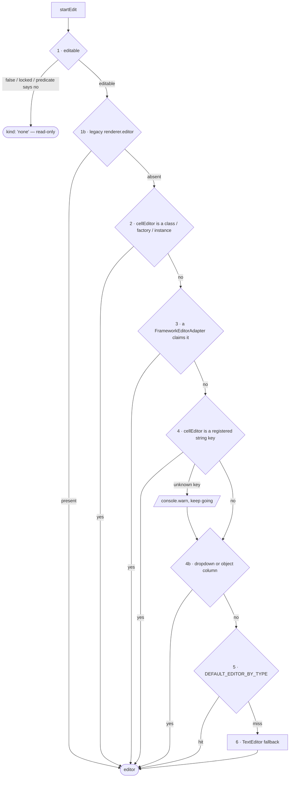
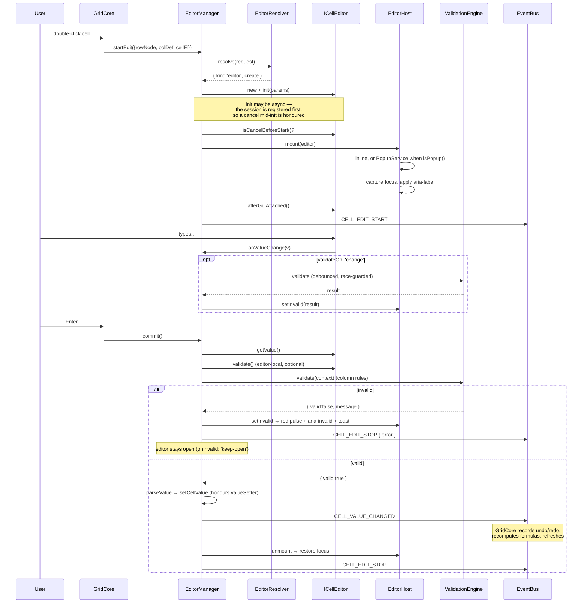

# Photon Grid — Editing Architecture

> Status: **Phase 1 (core)** complete. Framework adapters (Angular / React / Vue) and the
> Angular + vanilla example apps follow in phases 2 and 3.

---

## 1. Why this exists

The previous editing system was one class with one `switch (colDef.type)`. Adding an editor meant
editing grid internals; validation was four loose fields on `ColumnDef` funnelled through a second
switch; there was no editor interface, no registry, and no way to hand the grid a component.

This architecture inverts that. The grid knows an **interface** and a **registry**. Everything else —
which editor a column gets, how a value is validated, how an Angular component becomes an editor —
is data or a registration, never a branch in core.

**Design rules, in priority order:**

1. The core never imports a UI framework. Ever.
2. Editors collect values. The **grid** owns validation.
3. Adding an editor, a rule, or a framework must require **zero** changes to `src/`.
4. Nothing an existing grid does may break.

---

## 2. Folder structure

```
src/editing/
├── index.ts                          Public barrel (re-exported from src/index.ts)
├── create-editing-services.ts        Composition root: builds and wires the subsystem
│
├── types/
│   ├── cell-editor.types.ts          ICellEditor, CellEditorParams, CellEditorSpec,
│   │                                 EditableSpec, FrameworkEditorAdapter
│   ├── validation.types.ts           ValidationResult, ColumnValidation, ValidatorFn,
│   │                                 ValidationContext, RowValidatorFn
│   └── editing-config.types.ts       EditingConfig + resolveEditingConfig()
│
├── registry/
│   ├── editor-registry.ts            name -> editor      (last-in wins)
│   ├── editor-adapter-registry.ts    the framework seam
│   └── default-editor-resolver.ts    DEFAULT_EDITOR_BY_TYPE + the 6-step strategy chain
│
├── validation/
│   ├── rules/index.ts                13 built-in rule factories
│   ├── type-rules.ts                 ColumnType -> implied rules  (a map, not a switch)
│   ├── validator-registry.ts         name -> rule factory
│   └── validation-engine.ts          compiles per column, runs sync-fast / async-when-needed
│
├── editors/
│   ├── base/abstract-editor.ts       lifecycle + listener bookkeeping
│   ├── base/input-editor.ts          shared <input>-backed editor
│   └── …15 built-in editors…
│
├── services/
│   ├── editor-host.ts                mounts inline or popup; owns the a11y wiring
│   ├── popup-service.ts              portal + placement + dismissal
│   ├── focus-manager.ts              focus capture/restore + popup trap
│   └── keyboard-manager.ts           key -> action registry
│
├── session/
│   ├── edit-session.ts               session state + the race-guard id
│   └── editor-manager.ts             the orchestrator
│
└── compat/
    └── legacy-editors.ts             renderer.editor slot + the rich dropdown
```

---

## 3. Component map



The dashed edge is the **only** place a framework touches the system, and it points inwards from
outside the core.

---

## 4. Editor resolution

Six strategies, first non-null wins. This is the priority the brief specifies, encoded as an array
rather than a conditional cascade — so a host can insert its own step with `resolver.use(strategy, i)`.



Steps **1b** and **4b** are the backward-compatibility strategies, spliced into the default chain by
`createEditingServices`. 1b keeps the old `renderer.editor` slot at the absolute priority it always
had; 4b keeps `dropdown`/`object` columns on the rich virtualised list rather than silently
downgrading them to a native `<select>`.

An unknown string key **warns and falls through** rather than throwing. A typo should degrade to a
working text editor, not take the grid down.

---

## 5. Session lifecycle



**Escape** routes to `cancel()`, which tears down without writing. **Tab** routes to
`commitAndMove()`, which commits and hands off to the grid's navigation handler.

---

## 6. Validation

Editors do not validate. They *may* contribute an opinion through the optional `ICellEditor.validate`
(for state only they know — a half-filled mask, an autocomplete matching no option), but the column's
rules are the grid's, which is precisely why validation behaves identically for a built-in editor, a
React component and an `<ng-template>`.

### Rule sources, merged in precedence order

```
impliedValidationFor(colDef)     type: 'email'  →  { email: true }
        ↓  (overridden by)
legacy fields                    required / min / max / validatorFn
        ↓  (overridden by)
colDef.validation                the documented home
```

### Fixed execution order

`required → email → url → pattern → min → max → minLength → maxLength → integer → decimal →
positive → negative → date → (registered extensions) → validate → validateAsync`

Emptiness reports before range, so a blank required cell says *"Price is required"* rather than
*"Price must be at least 10"*.

### Sync-fast, async-when-needed

`validate()` returns `ValidationResult | Promise<ValidationResult>`. When every rule is synchronous
it returns a **plain value** — an ordinary edit never waits a microtask. Async rules run only after
everything synchronous has passed, so a blank field costs no network round trip.

Async results are **race-guarded** by the session id: a response for a superseded session is dropped,
never applied to whichever cell happens to be open by the time it lands.

---

## 7. Extension points

| I want to… | Do this | Touches core? |
|---|---|---|
| Ship a new editor | `gridApi.registerEditor('rating', RatingEditor)` | No |
| Override a built-in | `gridApi.registerEditor('text', MyTextEditor)` — last-in wins | No |
| Add a validation rule | `gridApi.registerValidator('iban', factory)` | No |
| Support a framework | `gridApi.registerEditorAdapter({ name, canHandle, create })` | No |
| Add a keyboard binding | `keyboardManager.register({ name, key, ctrl, run })` | No |
| Change resolution priority | `resolver.use(strategy, index)` | No |
| Change where popups mount | Swap the `PopupService` passed to `EditorHost` | No |

Every one of these is a registration or a constructor argument. That is the Open/Closed principle
holding in practice rather than in a comment.

---

## 8. Performance

| Concern | How it is handled |
|---|---|
| Rule compilation | `ValidationEngine.compile` memoises per `ColumnDef` in a `WeakMap`. A 100k-row grid compiles a column's rules **once**, not once per cell. |
| Editor resolution | Once per session, not per keystroke. |
| Keystrokes | `updateValue` writes one field. No allocation on the typing path. |
| `validateOn: 'change'` | Debounced (default 150 ms) and race-guarded. |
| Pattern rules | `RegExp` compiled once in the factory; `/g`/`/y` stripped so `lastIndex` cannot make the same rule alternate verdicts. |
| Popups | Mounted into the existing theme portal — no grid reflow, no second positioning implementation. |
| Listener hygiene | `AbstractCellEditor` records every listener and releases them in `destroy()`; `EditSession.disposers` does the same for session-scoped ones. |

---

## 9. How a rejected value is reported

Three channels, each doing the one thing it is good at:

| Channel | Carries | Lifetime |
|---|---|---|
| **Red pulse on the cell** | *Where* the problem is | One 600 ms animation, then gone |
| **Toast** (`ToastService`) | *Why* — the rule's message | The toast service's own duration |
| **`aria-invalid`** | *That* the value is rejected | Until the value validates or the edit is cancelled |

The split is deliberate. A validation message is usually longer than a column is
wide, so an inline banner either truncated it or pushed the row around; and a
persistent red border left the grid looking broken long after the user had read
and understood the problem. Location is a visual question and belongs on the
cell; explanation is a text question and belongs somewhere with room for a
sentence.

`aria-invalid` is the exception that stays: it is *state*, not notification, and
a screen-reader user re-reading the field after the pulse and the toast have
gone must still be told the value was refused. The message is additionally
pushed through a grid-level polite live region at the moment of failure.

Where the message goes is injectable — `EditorHost.setInvalidReporter` — so an
application can route failures to its own notification system instead. Left
unset (a test, a headless embedding) the cell still pulses and assistive
technology is still told; only the toast is skipped.

---

## 10. Accessibility

- Every editor is labelled from its column header (`aria-label`), so no editor is
  an anonymous text box. Composite editors label their *inner* control too —
  otherwise a screen reader reads the group name and then an unnamed input.
- Rejection: `aria-invalid` plus a polite live-region announcement (see §9).
- Popups are `role="dialog"` with a focus trap and Escape-to-close. `aria-modal`
  is deliberately **not** set — the grid behind stays readable, and claiming
  modality would lie to a screen reader.
- Focus is captured on open and restored on close, with the cell as fallback when
  the original element has been recycled away. Focusing a detached node silently
  drops focus to `<body>` and breaks grid navigation until the user clicks again.
- The autocomplete implements the full combobox pattern: `aria-expanded`,
  `aria-controls`, `aria-activedescendant` (removed when nothing is active),
  `aria-autocomplete="list"`, `role="option"` + `aria-selected`, and a live
  result count.
- The range editor keeps `aria-valuemin`/`max`/`now`/`text` in sync as it moves;
  the switch is `role="switch"` + `aria-checked`; the password reveal is
  `aria-pressed`.
- **Keyboard parity with the mouse**: `Enter`/`F2` opens the editor on the focused
  cell, a printable character opens it seeded with that character, `Escape`
  cancels, `Tab` commits and moves. A `select`, `date`, `datetime` or `time` cell
  opens its native picker on entry, so the control is usable without a second
  pointer gesture.
- `prefers-reduced-motion` removes the pulse and the popup entrance; the failure
  still reaches the user through the toast and `aria-invalid`, so no information
  is lost.
- `forced-colors` (Windows high contrast) re-states the editing ring in system
  colours, which tokens do not survive.

---

## 11. Backward compatibility

Nothing existing breaks. Specifically:

| Old surface | Status |
|---|---|
| `colDef.editable: boolean` | Works. Widened to also accept a predicate. |
| `colDef.required / min / max / validatorFn` | Work. Normalised into rules by the engine. `@deprecated`. |
| `colDef.renderer.editor` slot | Works, at its original priority, via `LegacySlotEditor`. |
| `dropdown` / `object` columns | Keep the rich virtualised dropdown via `LegacyDropdownEditor`. |
| `CellEditorEngine` | Exported, delegating facade over `EditorManager`. `@deprecated`. |
| `GridApi.startCellEditing` / `stopEditing` | Unchanged signatures. |
| `CELL_EDIT_START` / `CELL_EDIT_STOP` / `CELL_VALUE_CHANGED` / `ROW_EDIT_START` | Emitted identically, so undo/redo, formula recompute and refresh wiring is untouched. |
| Formula cells | Editor still opens on the formula *source*; commit still parses against the real column type. |
| `pg-editor*` CSS classes | Unchanged. New surfaces take new names. |

The one genuine removal is `CellEditorEngine.buildNativeEditor`, which has no meaning once editors come
from a registry. It warns and returns an empty element rather than throwing.

---

## 12. Best practices

**Do**
- Let the column type pick the editor. `{ field: 'price', type: 'number', editable: true }` is a
  complete, correct configuration.
- Put rules in `validation`, not in the editor. That is what makes them work across frameworks.
- Return `null` from a `ValidatorFactory` when its config disables the rule, so the compiled list holds
  no no-ops.
- Implement `destroy()` on any editor holding a timer, a listener outside `getGui()`, or a subscription.
- Use `isPopup()` for anything larger than a cell.

**Don't**
- Write to `params.data` from an editor. Report through `onValueChange` and let the commit path write.
- Assume `getGui()` is in the document during `init` — it is not. Measure in `afterGuiAttached()`.
- Duplicate a column rule inside an editor. It will drift.
- Register a loose `canHandle` on an adapter; it will swallow specs meant for another framework in a
  mixed page.

---

## 13. Future extension points

Deliberately designed for, not yet built:

- **Row editing** — `EditingConfig.mode: 'row'` and `rowValidator` are defined and plumbed; the
  multi-cell session is the remaining work.
- **Framework adapters** — the contract ships now; phase 2 implements the three wrappers.
- **Fill-handle and paste validation** — `EditorManager.commitValue` already validates a write with no
  editor, which is the hook clipboard and autofill paths need.
- **Server-side validation state** — `CellValidationState` is defined so failures can be persisted and
  rendered outside an open session.
- **Editor-level undo** — `KeyboardManager` bindings are per-grid; scoping to a session is additive.
